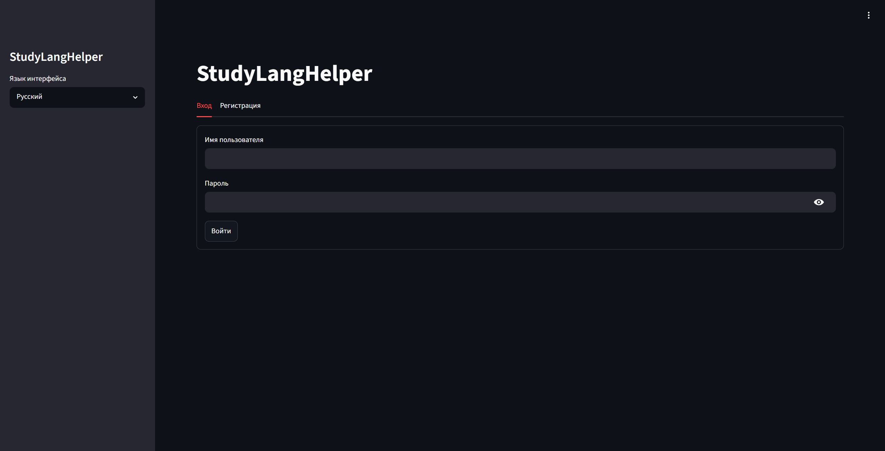
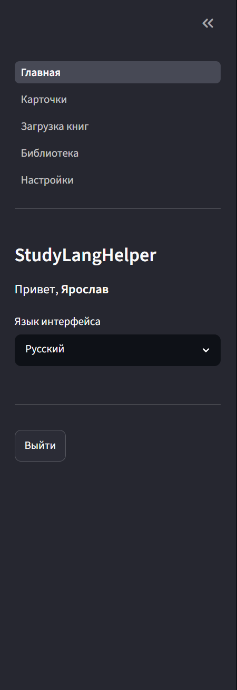
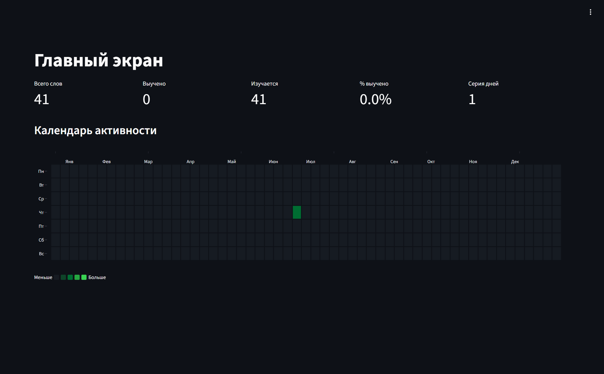
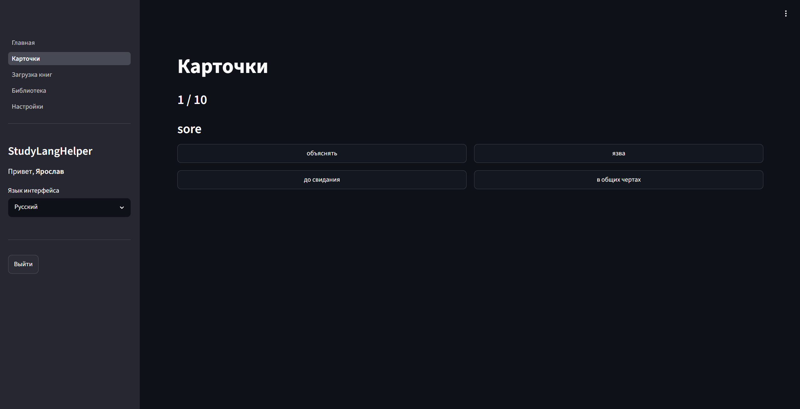
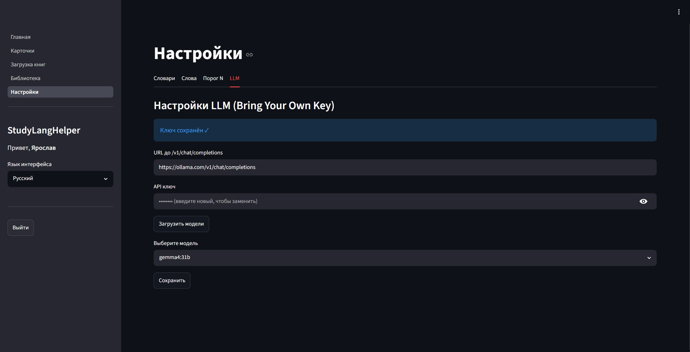
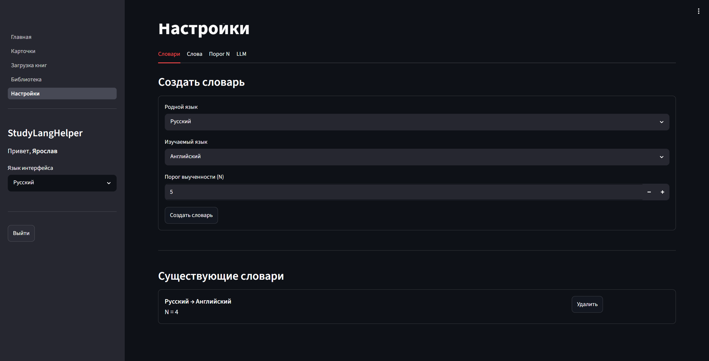
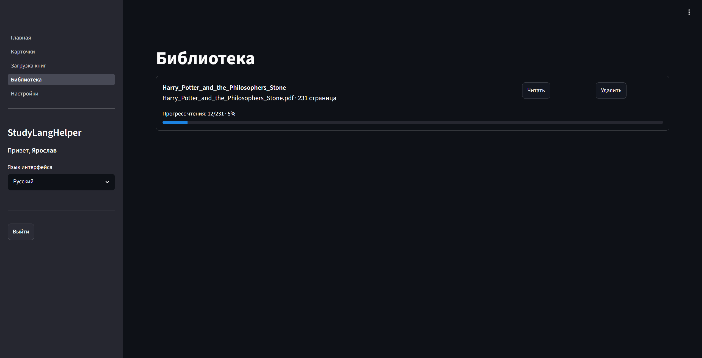
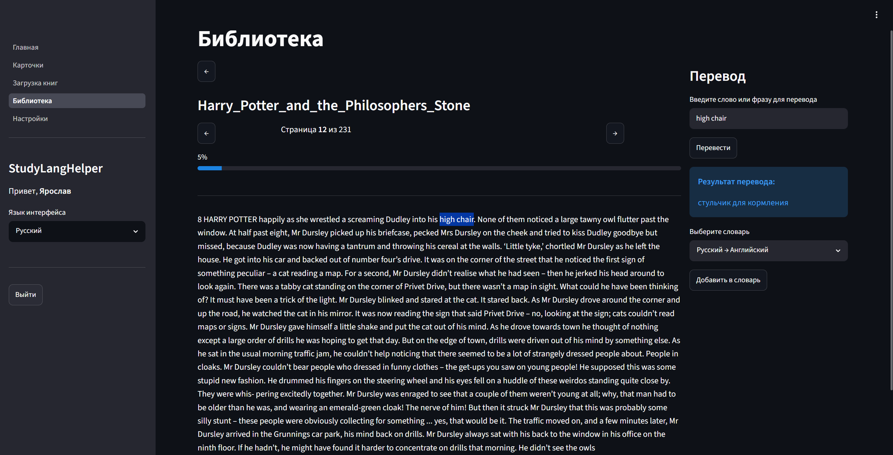
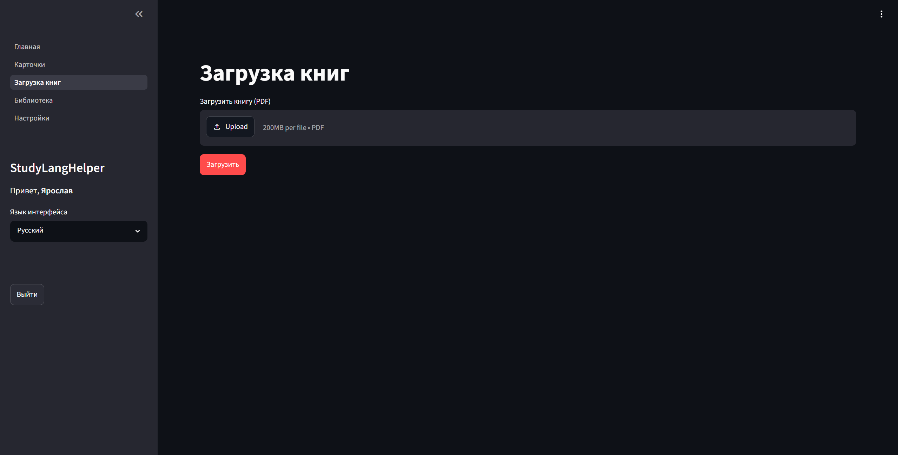

# StudyLangHelper


📖 [Документация на русском](README.md)

A foreign language learning app: word flashcards, statistics, an activity calendar, and a PDF library with LLM-powered translation.

## Table of Contents

- [StudyLangHelper](#studylanghelper)
  - [Table of Contents](#table-of-contents)
  - [✨ Features](#-features)
    - [🔐 Authentication](#-authentication)
    - [🏠 Home](#-home)
    - [🃏 Cards](#-cards)
    - [⚙️ Settings](#️-settings)
    - [📚 Library](#-library)
    - [📤 Upload Books](#-upload-books)
  - [🛠 Tech Stack](#-tech-stack)
  - [🐳 Quick Start (Docker)](#-quick-start-docker)
  - [⚙️ Local Development](#️-local-development)
    - [Run (two terminals)](#run-two-terminals)
  - [🗄 Database](#-database)
  - [🔧 Environment Variables](#-environment-variables)
  - [🧪 Testing](#-testing)
  - [📏 Linting](#-linting)
  - [📁 Project Structure](#-project-structure)
  - [📄 License](#-license)

## ✨ Features

### 🔐 Authentication
- Register and log in with a username / password
- JWT tokens (HS256), password hashing via bcrypt
- Per-user storage: dictionaries, LLM API keys, book library — isolated between users
- On first registration, existing dictionaries (if the DB was created before auth was introduced) are automatically assigned to the first user

<!-- Screenshot: login / register page. Insert:  -->


<!-- Screenshot: sidebar with username and "Log out" button. Insert:  -->


### 🏠 Home
- Activity calendar (GitHub-style heatmap for the current year)
- Statistics: total words, learned, learning, learned %, day streak

<!-- Screenshot: home screen with activity calendar and statistics. Insert:  -->


### 🃏 Cards
- Modes: review learned words / learn new words
- Direction: word → translation / translation → word
- Configurable number of cards
- 4 answer options with the correct one highlighted on mistake
- Final results as percentages

<!-- Screenshot: card with 4 answer options. Insert:  -->


### ⚙️ Settings
- **Dictionaries**: create dictionaries by language pair (native ↔ study). The EN↔RU pair is auto-seeded with 10 popular words. Other pairs require manual input.
- **Words**: add/delete pairs, view status (learned/learning), filter
- **Threshold N**: configure how many correct answers mark a word as learned (per dictionary)
- **LLM (Bring Your Own Key)**: enter the URL to `/v1/chat/completions` of your provider, API key, load available models via `/v1/models`, select a model. The key is stored in the DB (plaintext for self-hosted) and is never returned in GET responses.

<!-- Screenshot: LLM tab in Settings (base_url, api_key, model selection). Insert:  -->


<!-- Screenshot: "Dictionaries" tab in Settings. Insert:  -->


### 📚 Library
- Upload PDF books (text is extracted page-by-page via pdfplumber, binary files are not stored)
- Read with page-by-page navigation (← / → buttons)
- Translate a selected word or phrase via LLM right while reading
- Add the translated word to a chosen dictionary
- Reading progress: progress bar on each book + position saving (resume where you left off)
- Deduplication: re-uploading a file with the same name is rejected (409 Conflict)

<!-- Screenshot: book list with reading progress bars. Insert:  -->


<!-- Screenshot: book reading mode with translation panel on the right. Insert:  -->


### 📤 Upload Books
- A dedicated page for uploading PDF files
- Visual upload indicator (`st.status` with stages "Sending file and parsing PDF…" → "Done")
- API-level duplicate protection (409 Conflict when re-uploading a file with the same name)

<!-- Screenshot: "Upload Books" page with st.status indicator. Insert:  -->


## 🛠 Tech Stack

| Component | Technology |
|-----------|------------|
| Backend | FastAPI + SQLModel + SQLite |
| Auth | JWT (PyJWT) + bcrypt |
| PDF parsing | pdfplumber |
| Frontend | Streamlit + Plotly |
| LLM | OpenAI-compatible API (BYOK) |
| Runtime | Python 3.12 |
| Package manager | uv |
| Containers | Docker Compose |

## 🐳 Quick Start (Docker)

```bash
docker compose up -d --build
```

- Backend: http://localhost:8000 (docs: http://localhost:8000/docs)
- Frontend: http://localhost:8501

The SQLite database is stored in `./data/studylanghelper.db` (bind mount) and persists across restarts. The `data/` directory is created automatically and is gitignored.

Stop:

```bash
docker compose down          # stop, data is preserved
```

To reset the database, remove the `data/` directory manually:

```bash
docker compose down
Remove-Item -Recurse -Force data   # Windows PowerShell
# or: rm -rf data                  # Linux/macOS
```

## ⚙️ Local Development

Dependencies are split into optional-groups `backend` and `frontend`. For local development install both:

```bash
uv sync --extra backend --extra frontend
# or equivalently:
uv sync --group local
```

> ⚠️ **Note**: `uv sync` without arguments installs only base dependencies (empty set).
> Always specify `--extra backend --extra frontend` or `--group local` for full functionality.

### Run (two terminals)

```bash
# 1. Backend
uv run uvicorn backend.main:app --reload --port 8000

# 2. Frontend
uv run streamlit run frontend/app.py
```

## 🗄 Database

- **Location**: `data/studylanghelper.db` (auto-created on first run)
- **Docker**: bind-mounted at `./data:/app/data`
- **Gitignored**: yes (`.gitignore`)
- **Reset**: delete the `data/` directory
- **Migrations**: on startup, the `user_id` column is automatically added to the `dictionary` table (for DBs created before auth was introduced)

## 🔧 Environment Variables

| Variable | Default | Description |
|----------|---------|-------------|
| `DATABASE_URL` | `sqlite:///<project>/data/studylanghelper.db` | Database connection URL |
| `CORS_ORIGINS` | `http://localhost:8501,http://127.0.0.1:8501` | Comma-separated list of CORS origins |
| `JWT_SECRET` | `dev-secret-change-me` | Secret for signing JWT tokens. **Must be changed in production** |
| `API_BASE_URL` | `http://localhost:8000` | Backend URL for the frontend (Streamlit) |

> ⚠️ In production, always set `JWT_SECRET` to a random string of ≥ 32 bytes.

## 🧪 Testing

```bash
uv run pytest
```

29 tests cover: authentication (register, login, user isolation), dictionaries, words, study sessions, statistics, LLM (with httpx mocks), library (with PDF generation via reportlab).

## 📏 Linting

```bash
uv run ruff check .
uv run ruff format --check .
```

## 📁 Project Structure

```
StudyLangHelper/
├── backend/                  # FastAPI + SQLModel + SQLite
│   ├── main.py               # entry point, router registration
│   ├── security.py           # JWT (PyJWT) + bcrypt, get_current_user
│   ├── llm.py                # OpenAI-compatible LLM client (BYOK)
│   ├── parsing.py            # PDF → page-by-page text (pdfplumber)
│   ├── config.py             # DATABASE_URL, CORS_ORIGINS
│   ├── database.py           # engine, create_db_and_tables, user_id migration
│   ├── models.py             # User, Dictionary, Word, StudySession, Answer, LLMSettings, Book
│   ├── schemas.py            # Pydantic schemas (auth, LLM, library, ...)
│   ├── languages.py          # language reference
│   ├── seed.py               # 10 EN↔RU words for auto-seeding
│   ├── routers/
│   │   ├── auth.py           # register, login, /me
│   │   ├── dictionaries.py   # dictionary CRUD (auth-protected)
│   │   ├── words.py          # word CRUD (auth-protected)
│   │   ├── study.py          # study sessions, answers (auth-protected)
│   │   ├── stats.py          # statistics, calendar (auth-protected)
│   │   ├── llm.py            # LLM settings, model list, translate
│   │   └── library.py        # upload/read/delete PDF books
│   └── Dockerfile
├── frontend/                 # Streamlit + Plotly
│   ├── app.py                # auth gate, navigation, logout
│   ├── api_client.py         # HTTP client with Bearer token
│   ├── config.py             # API_BASE_URL
│   ├── i18n.py               # localization (ru/en)
│   ├── state.py              # session_state helpers
│   ├── pages/
│   │   ├── login.py          # login / register
│   │   ├── home.py           # activity calendar + statistics
│   │   ├── cards.py          # study cards
│   │   ├── upload.py         # upload PDF books
│   │   ├── library.py        # read books + LLM translation
│   │   └── settings.py       # dictionaries, words, threshold N, LLM
│   └── Dockerfile
├── data/                     # SQLite DB (gitignored)
├── tests/
│   ├── conftest.py           # in-memory SQLite, authed_client fixture
│   └── api/test_api.py       # 29 tests
├── docker-compose.yml
└── pyproject.toml
```

## 📄 License

Distributed under the [MIT License](LICENSE).